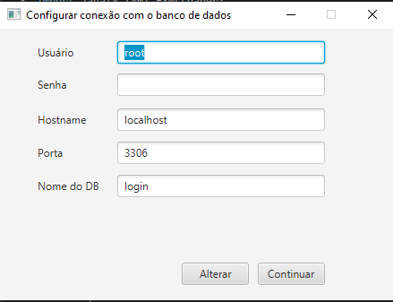
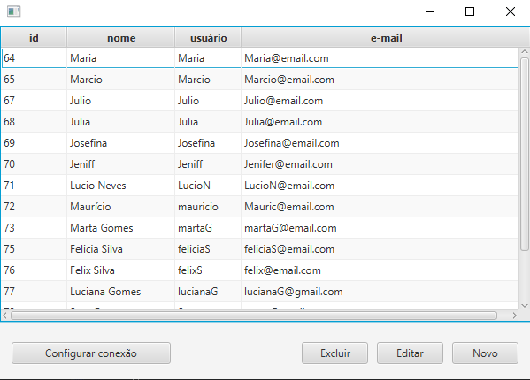
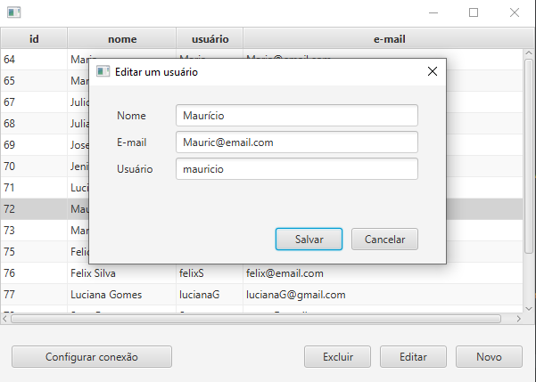
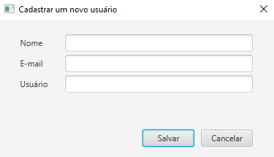

# Crud usuarios
## Descrição
  Crud de uma tabela de usuários com nome, e-mail e login. 
## Usando o projeto
1. Criar o banco de dados
2. Criar as tabelas executando o arquivo DUMP.sql
3. Configurar a conexão com o banco de dados através da tela ou do arquivo db.properties
4. Executar a classe src/main/java/application/App.java ou a classe src/test/java/main/CrudTest.java para testar as funções
Observação: Podem ocorrer problemas no encoding dos caracteres ao executar no VSCode
## Screenshots
### Configuração de conexão

### Tela principal

### Editar Usuário

### Novo usuário

